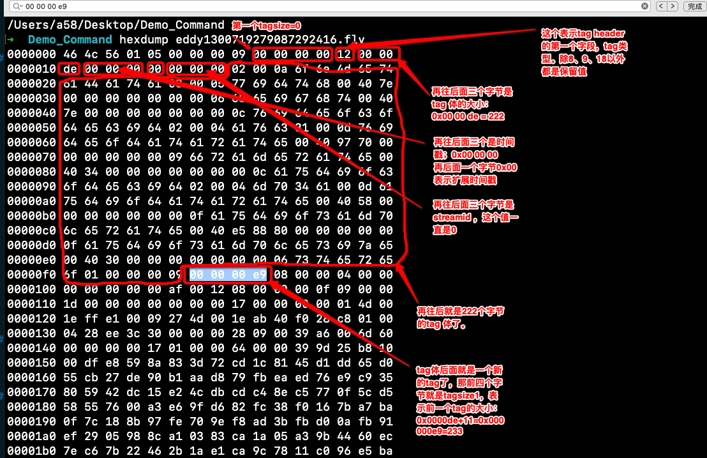

## FLV 格式学习笔记
###  概述
* FLV文件中的每种标签类型都构成一个流。 FLV文件中最多只能同步同步一个音频和一个视频流。 FLV文件不能定义单个类型的多个独立流。
* 与SWF文件不同，FLV文件以big-endian字节顺序存储多字节整数。 例如，作为SWF文件格式的UI16，代表数字300（0x12C）的字节序列为0x2C 0x01； 作为FLV文件格式的UI16，代表数字300的字节序列为0x01 0x2C。 同样，FLV文件使用SWF文件中未使用的3字节整数类型：UI24表示无符号的24位整数。
* FLV文件由文件头 header 和 文件体组Body成，文件体又有PreviousTagSize 和 tag 组成，tag又由tag header 和 tag body 组成。

### FLV Header
所有的FLV文件都是以下面的Header开头的

#### header字段分析
* Signature 前三个**字节**是固定的“FLV”的标识；十六进制：0x46=F 0x4C=L 0x56=V
* Version 第四个字节表示flv的版本号。0x01就代表FLV的版本号就是1
* TypeFlagsReserved 第五个字节的前5个二进制位。保留值，必须是0。 0x05 = **00000**101
* TypeFlagsAudio 第五个字节的第6个二进制位。1表示有audio，0表示没有。0x05 = 00000**1**01
* TypeFlagsReserved 第五个字节的第7个二进制位。保留值。 必须是0。0x05 = 000001**0**1
* TypeFlagsVideo 第五个字节的最后一个二进制位。1表示有video，0表示没有。0x05 = 0000010**1**
* DataOffset : 最后4个字节表示FLV header 长度，对于version=1的情况下，最后这四个字节固定是9。0x00 00 00 09

### FLV Body
* body又由PreviousTagSize 和 tag 组成

#### body字段分析
* PreviousTagSize0 总是为0，占4个字节
* Tag1 这是第一个tag， tag大小在tag header中有字段表示
* PreviousTagSize1 占4个字节，表示前一个tag的大小。
* Tag2 这是第二个tag， tag大小在tag header中有字段表示
* ......
* PreviousTagSizeN-1 表示第N-1个tag的大小
* TagN 第N个tag，tag大小在tag header中有字段表示
* 以此类推。。。

**注意**
* 对FLV版本1，tag header固定为11个字节，PreviousTagSize（除第1个）的值为 11 + 前一个tag 的 tag body的大小 

#### tag结构
* flv tag 由 header 和 body 组成

##### tag header
header 结构如下：

header分析
* TagType 一个字节，8：音频，9：视频，18：script data, 其他是保留值
* DataSize 三个字节，tag body 的大小
* Timestamp 三个字节，毫秒时间戳，是相对于第一个tag的，不是相对于前一个！
* TimestampExtended 时间戳的扩展字段，当Timestamp3个字节不够用，会启用这个字段，比Timestamp高8位
* StreamID 三个字节，总是0
* Data： tag体，
    * TagType=8，则为AUDIODATA 
    * TagType=9，则为VIDEODATA 
    * TagType=18，则为SCRIPTDATAOBJECT

##### tag body 