2020年9月1日 北京 入秋了都，天气很棒
## FLV 格式学习笔记
###  概述
* FLV文件中的每种标签类型都构成一个流。 FLV文件中最多只能同步同步一个音频和一个视频流。 FLV文件不能定义单个类型的多个独立流。
* 与SWF文件不同，FLV文件以big-endian字节顺序存储多字节整数。 例如，作为SWF文件格式的UI16，代表数字300（0x12C）的字节序列为0x2C 0x01； 作为FLV文件格式的UI16，代表数字300的字节序列为0x01 0x2C。 同样，FLV文件使用SWF文件中未使用的3字节整数类型：UI24表示无符号的24位整数。
* FLV文件由文件头 header 和 文件体组Body成，文件体又有PreviousTagSize 和 tag 组成，tag又由tag header 和 tag body 组成。

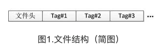
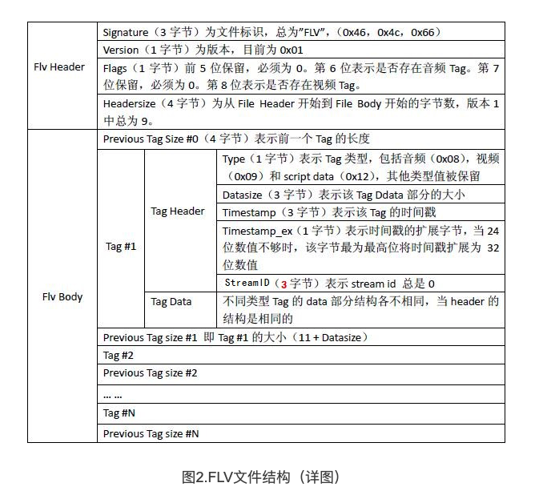

### FLV Header
所有的FLV文件都是以下面的Header开头的

#### header字段分析
* Signature 前三个**字节**是固定的“FLV”的标识；十六进制：0x46=F 0x4C=L 0x56=V
* Version 第四个字节表示flv的版本号。0x01就代表FLV的版本号就是1
* TypeFlagsReserved 第五个字节的前5个二进制位。保留值，必须是0。 0x05 = **00000**101
* TypeFlagsAudio 第五个字节的第6个二进制位。1表示有audio，0表示没有。0x05 = 00000**1**01
* TypeFlagsReserved 第五个字节的第7个二进制位。保留值。 必须是0。0x05 = 000001**0**1
* TypeFlagsVideo 第五个字节的最后一个二进制位。1表示有video，0表示没有。0x05 = 0000010**1**
* DataOffset : 最后4个字节表示FLV header 长度，对于version=1的情况下，最后这四个字节固定是9。0x00 00 00 09

### FLV Body
* body又由PreviousTagSize 和 tag 组成

#### body字段分析
* PreviousTagSize0 总是为0，占4个字节
* Tag1 这是第一个tag， tag大小在tag header中有字段表示
* PreviousTagSize1 占4个字节，表示前一个tag的大小。
* Tag2 这是第二个tag， tag大小在tag header中有字段表示
* ......
* PreviousTagSizeN-1 表示第N-1个tag的大小
* TagN 第N个tag，tag大小在tag header中有字段表示
* 以此类推。。。

**注意**
* 对FLV版本1，tag header固定为11个字节，PreviousTagSize（除第1个）的值为 11 + 前一个tag 的 tag body的大小 

### FLV Tag
* flv tag 由 header 和 body 组成

#### tag header
header 结构如下：
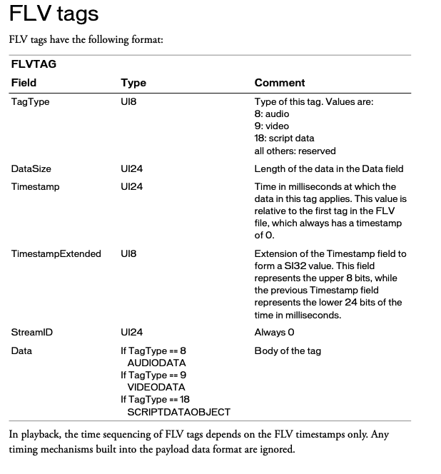

header分析
* TagType 一个字节，8：音频，9：视频，18：script data, 其他是保留值
* DataSize 三个字节，tag body 的大小
* Timestamp 三个字节，毫秒时间戳，是相对于第一个tag的，不是相对于前一个！
* TimestampExtended 时间戳的扩展字段，当Timestamp3个字节不够用，会启用这个字段，比Timestamp高8位
* StreamID 三个字节，总是0
* Data： tag体，
    * TagType=8，则为AUDIODATA 
    * TagType=9，则为VIDEODATA 
    * TagType=18，则为SCRIPTDATAOBJECT

**备注**
* 在播放中，FLV标签的时间顺序仅取决于FLV时间戳。 有效载荷数据格式中内置的任何计时机制都将被忽略。

### Audio Tag

#### audio tag 字段解析
* SoundFormat 第一个字节的前四个二进制位 **0000** 0000，
    * 0 = Linear PCM, platform endian  
    * 1 = ADPCM 
    * 2 = MP3  
    * 3 = Linear PCM, little endian  
    * 4 = Nellymoser 16-kHz mono 
    * 5 = Nellymoser 8-kHz mono  
    * 6 = Nellymoser  
    * 7 = G.711 A-law logarithmic PCM
    * 8 = G.711 mu-law logarithmic PCM 
    * 9 = reserved  
    * 10 = AAC  
    * 11 = Speex  
    * 14 = MP3 8-Khz  
    * 15 = Device-specific sound 
* SoundRate 第一个字节的第5和第6两个二进制位 0000 **00**00，对于aac来说这个值永远是3
    * 0 = 5.5-kHz 
    * 1 = 11-kHz 
    * 2 = 22-kHz 
    * 3 = 44-kHz
* SoundSize 第一个字节的第7个二进制位 0000 00**0**0，只要是压缩过的音频，这个值永远是1
    * 0 = snd8Bit 8位
    * 1 = snd16Bit 16位
* SoundType 第一个字节的最后一个二进制位 0000 000**0**，对Nellymoser来说，永远是单声道；对AAC来说，永远是双声道； 
    * 0 = sndMono 单声道 
    * 1 = sndStereo 双声道
* SoundData 如果是AAC，则为 AACAUDIODATA
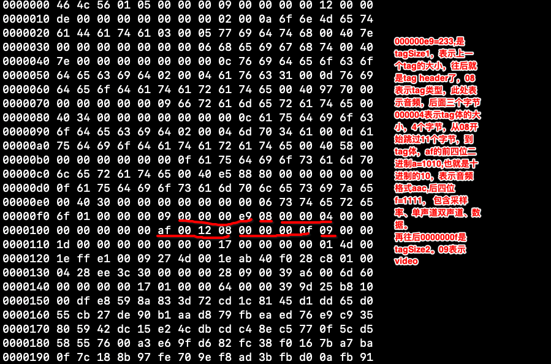

**备注**
* 如果SoundFormat指示AAC，则SoundType应该设置为1（立体声），SoundRate应该设置为3（44 kHz）。 但是，这并不意味着FLV中的AAC音频始终是44 kHz立体声数据。 相反，Flash Player会忽略这些值，并提取通道，并将采样率数据编码在AAC比特流中。
* 格式3，线性PCM，存储原始PCM样本。 如果数据为8位，则样本为无符号字节。 如果数据为16位，则将样本存储为小端数字符号。 如果数据是立体声的，则左右采样以交错方式存储：左-右-左-右-依此类推。格式0 PCM与格式3 PCM相同，不同之处在于格式0按照创建文件的平台的字节顺序存储16位PCM样本。 因此，不建议使用格式0。
* Nellymoser 8 kHz和16 kHz是特殊情况-其他格式不支持8和16 kHz采样率，并且SoundRate位不能表示该值。 在SoundFormat中指定Nellymoser 8-kHz或Nellymoser 16-kHz时，将忽略SoundRate和SoundType字段。 对于其他Nellymoser采样率，请指定常规的Nellymoser SoundFormat并照常使用SoundRate和SoundType字段。

#### AACAudioData 解析
当 SoundFormat 为0xa=1010=10时，表示音频采AAC进行编码，SoundData的定义如下：
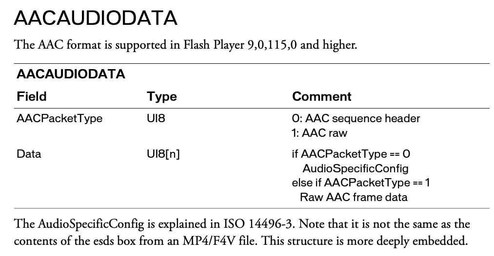

* AACPacketType 一个字节，表示AACAUDIODATA的类型。
    * 0: AAC sequence header AAC序列header
    * 1: AAC raw aac原始数据
* Data 
    * AACPacketType为0，则为AudioSpecificConfig 
    * 如果AACPacketType为1，则为AAC帧数据

**注意**
* 如果SoundFormat == 10时，AACPacketType这个字段才会出现
* AAC sequence header也就是包含了更加详细的音频信息数据，叫AudioSpecificConfig，它占两个字节

#### AudioSpecificConfig 解析

总共占2个字节 0001 0010 0000 1000
* audioObjectType 
    * 第一个字节的前5个二进制位,  **0001 0**010 0000 1000
    * 其实就是表示profile，编码档次
* samplingFrequencyIndex 
    * 第一个字节的后3个二进制位和第二个自己的第1个二进制位，共4位。0001 0**010 0**000 1000
    * 这是aac音频帧的前7个字节ADST组成元素，samplingFrequencyIndex最准确的信息是在AudioSpecificConfig中，所以就对AudioSpecificConfig进行解析并得到了samplingFrequencyIndex。
    * 44100 对应值永远是4
* channelConfiguration 
    * 第二个字节的第2个二进制位到第5个二进制位，共4位。0001 0010 0**000 1**000
    * 音频声道数，这里是最准的。
* frameLengthFlag 
    * 标志位，表示IMDCT窗口长度，0
* dependsOnCoreCoder
    * 标志位，表示是否依赖coreCoder 0
* extensionFlag
    * aac-lc，这里是0

### Video Tag

#### video tag 字段解析
* FrameType 第一个字节的前4个二进制位 帧类型
    * 1: 关键帧（对于AVC，是可搜索的帧），就是IDR帧
    * 2: 帧间（对于AVC，不可搜索的帧）非I帧
    * 3: disposable inter frame (H.263 only)
    * 4: generated keyframe (reserved for server use only)
    * 5: video info/command frame
* CodecID 第一个字节的后4个二进制位 编码标准
    * 1: JPEG (currently unused)  
    * 2: Sorenson H.263 
    * 3: Screen video  
    * 4: On2 VP6
    * 5: On2 VP6 with alpha channel 
    * 6: Screen video version 2  
    * 7: AVC（H264）
* VideoData  VideoFramePayload 视频帧数据，得根据CodecID的不同而不同
    * 2: H263VIDEOPACKET          CodecID=2
    * 3: SCREENVIDEOPACKET        CodecID=3
    * 4: VP6FLVVIDEOPACKET        CodecID=4
    * 5: VP6FLVALPHAVIDEOPACKET   CodecID=5
    * 6: SCREENV2VIDEOPACKET      CodecID=6
    * 7: AVCVIDEOPACKE            CodecID=7

**注意：**
* 如果FrameType = 5，VideoData就不是视频有效载荷（VideoFramePayload）了，那VideoData就变成了一个字节的则消息流，这个字节的值表达的意义如下：
    * 0 = 客户端搜索视频帧序列的开始
    * 1 = 客户端搜寻视频帧序列的结尾

#### AVCVideoPacke 解析
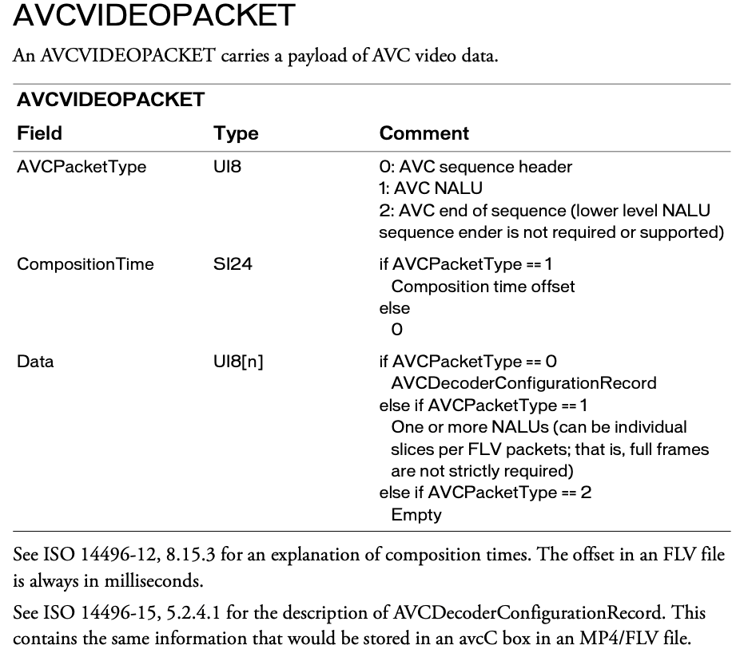

* AVCPacketType 一个字节
    * 0 AVC sequence header 
    * 1 AVC NALU 
    * 2 AVC end of sequence
* CompositionTime 三个字节
    * 如果AVCPacketType==1时，则此值表示cts(合成时间偏移量)的值，单位是毫秒
    * 否则该值等于0
* Data 数据，
    * 如果AVCPacketType==0，则该值等于AVCDecoderConfigurationRecord
    * 如果AVCPacketType==1，一个或多个NALU（每个FLV数据包可以是单个切片；也就是说，不严格要求完整帧）
    * 如果AVCPacketType==2，空值

**备注：**
* NALU：这是H264编码器把编码后的数据封装成一个一个小单元，包括pps/sps/sei/videorawdata
* AVCDecoderConfigurationRecord：包含着是H.264解码相关比较重要的sps和pps信息，再给AVC解码器送数据流之前一定要把sps和pps信息送出，否则的话解码器不能正常解码。而且在解码器stop之后再次start之前，如seek、快进快退状态切换等，都需要重新送一遍sps和pps的信息.AVCDecoderConfigurationRecord在FLV文件中一般情况也是出现1次，也就是第一个video tag.
* CTS（Composition time offset）：当B帧的存在时，视频解码呈现过程中，dts、pts可能不同，cts的计算公式为 pts - dts/90，单位为毫秒；如果B帧不存在，则cts固定为0；

#### AVCDecoderConfigurationRecord 解析
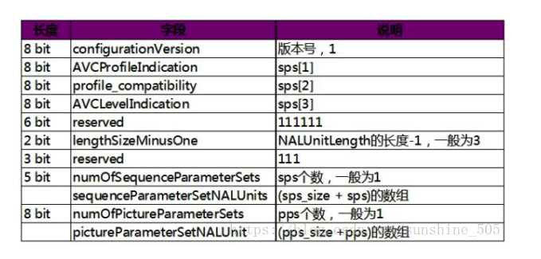

* configurationVersion 一个字节
    * 版本号，1
* AVCProfileIndication 一个字节
    * sps[1]
* profile_compatibility 一个字节
    * sps[2]
* AVCLevelIndication 一个字节
    * sps[3]
* reserved 6个二进制位，保留值 
    * 111111
* lengthSizeMinusOne 两个二进制位
    * NALUnitLength的长度-1，一般为3=11
* reserved 三个二进制位， 保留值
    * 111
* numOfSequenceParameterSets 五个二进制位
    * sps的个数，一般是00001
* sequenceParameterSetLength
* sequenceParameterSetNALUnits
* numOfPictureParameterSets
* pictureParameterSetLength
* pictureParameterSetNALUnits

### Script Tag Data结构（控制帧）
* 该类型Tag又通常被称为Metadata Tag，会放一些关于FLV视频和音频的元数据信息如：duration、width、height等。通常该类型Tag会跟在File Header后面作为第一个Tag出现，而且只有一个。
* 它的定义相对复杂些，采用AMF（Action Message Format）封装了一系列数据类型，比如字符串、数值、数组等。
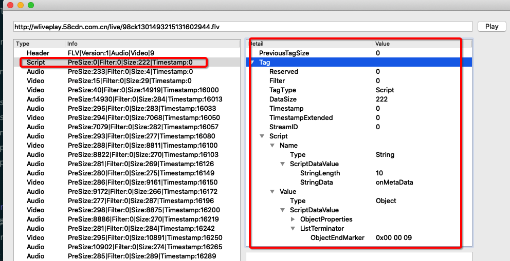
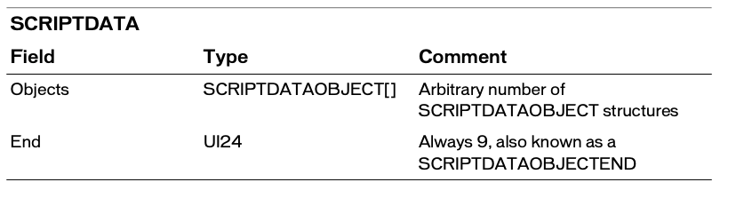

* Objects：字段类型是SCRIPTDATAOBJECT[]，任意数量的SCRIPTDATAOBJECT结构
* End: 三个字节，永远是9，标识着Script Data的结束，也叫SCRIPTDATAOBJECTEND

#### ScriptDataObject 和 ScriptDataObjectEnd
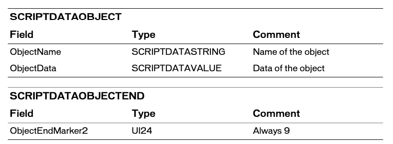
    * ObjectName 对象的名字
    * ObjectData 对象的值
    * ObjectEndMarker2 三个字节，永远是9，标识着Script Data的结束

#### ScriptDataValue
SCRIPTDATAVALUE 表示ActionScript值或对象的抽象定义。 它可以包含值，对象，变量或数组的列表。
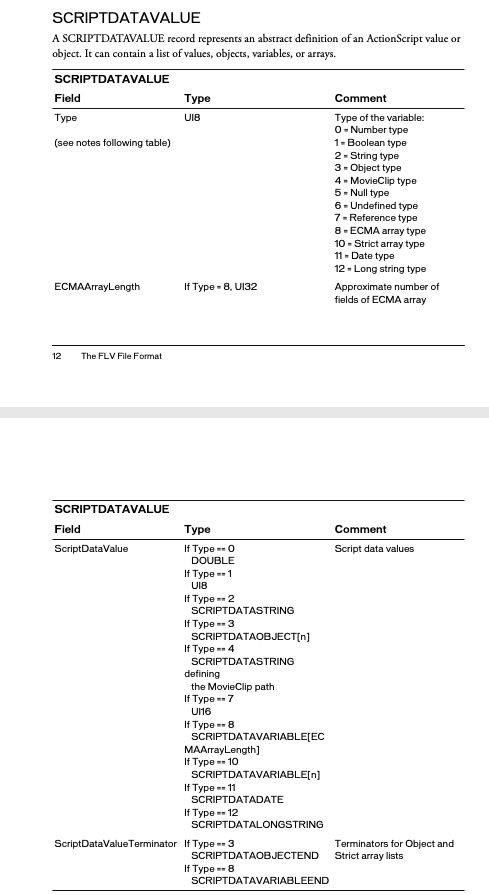

* Type：一个字节
    * 0 = Number type  
    * 1 = Boolean type  
    * 2 = String type  
    * 3 = Object type  
    * 4 = MovieClip type  
    * 5 = Null type  
    * 6 = Undefined type  
    * 7 = Reference type 
    * 8 = ECMA array type 
    * 10 = Strict array type 
    * 11 = Date type  
    * 12 = Long string type
* ECMAArrayLength  如果Type为8（数组），则为UI32也就是4个字节，表示数组长度
* ScriptDataValue  变量的值
    * If Type == 0 DOUBLE
    * If Type == 1 UI8
    * If Type == 2 SCRIPTDATASTRING
    * If Type == 3 SCRIPTDATAOBJECT[n]
    * If Type == 4 SCRIPTDATASTRING defining the MovieClip path
    * If Type == 7 UI16
    * If Type == 8 SCRIPTDATAVARIABLE[ECMAArrayLength] 
    * If Type == 10 SCRIPTDATAVARIABLE[n] 
    * If Type == 11 SCRIPTDATADATE 
    * If Type == 12 SCRIPTDATALONGSTRING
* ScriptDataValueTerminator   Object、Array的结束符
    * 如果 Type==3，则为SCRIPTDATAOBJECTEND
    * 如果 Type==8，则为SCRIPTDATAVARIABLEEND

下面这个就是FLV文件中的第一个tag，
* 可以看到跳过previousTagSize0后第一个字节0x12=18，18表示Script Data。
* 其他字段下图解析的很清楚了

**备注：**
* 如果Type = 8（ECMA数组类型），则ECMAArrayLength会向软件提供有关数组中可能有多少项的提示。 数组继续，直到出现SCRIPTDATAVARIABLEEND。
* 如果Type = 10（严格数组类型），则数组以UI32类型开头，并包含该确切数量的项目。 该数组不以SCRIPTDATAVARIABLEEND标记终止。

#### ScriptDataVariable and ScriptDataVariableEnd
SCRIPTDATAVARIABLE在ActionScript中定义变量数据。通过使用SCRIPTDATAVARIABLEEND标记可以终止SCRIPTDATAVARIABLE记录的列表。

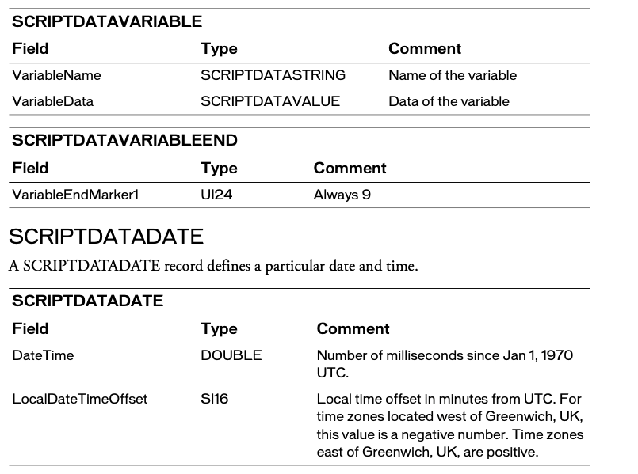
* ScriptDataVariable
    * VariableName ScriptDataString类型，变量的名字
    * VariableData ScriptDataValue类型，变量的值
*  ScriptDataVariableEnd
    *  VariableEndMarker1 三个字节，总是9 = 0x00 00 09

#### ScriptDataDate 
ScriptDataDate 定义特定的日期和时间
* DateTime double类型，自UTC(世界标准时间) 1970年1月1日以来的毫秒数。
* LocalDateTimeOffset 两个字节，本地时间对于UTC的偏移，以分钟为单位。对于位于英国格林威治以西的时区，该值为负数。在英国格林威治以东的时区积是正数。

### onMetaData
onMetaData中包含了音视频相关的元数据，封装在Script Data Tag中，它包含了两个AMF，通过onMetaData来进一步了解ScriptData
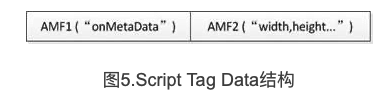
* 第一个AMF包：
    * 第1个字节：0x02，表示字符串类型
    * 第2-3个字节：UI16类型，值为0x000A，表示字符串的长度为10，即onMetaData的长度
    * 第4-13个字节：字符串onMetaData对应的16进制数字（0x6F 0x6E 0x4D 0x65 0x74 0x61 0x44 0x61 0x74 0x61）
* 第二个AMF包：
    * 第1个字节：0x08，表示数组类型；
    * 第2-5个字节：UI32类型，表示数组的长度，onMetaData中具体包含哪些属性是不固定的。
    * 第6个字节+：比如duration，后面即为各数组元素的封装，数组元素为元素名称和值组成的对。
        * 比如duration，则第6-9个字节：0x0008，表示长度为8个字节
        * 第10-17个字节：0x6475 7261 7469，表示 duration 这个字符串；
        * 第18个字节：0x00，表示为数值类型；
        * 第19-26个字节：0x...，表示具体的时长
        * ......

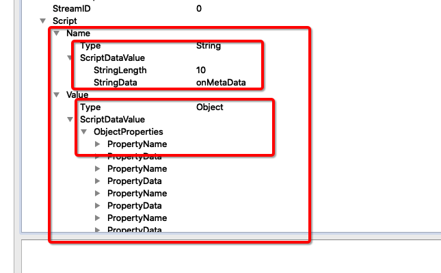 
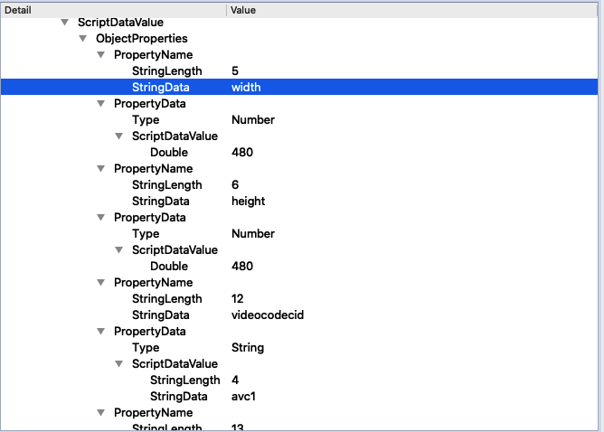 

更多onMetaData字段的定义：
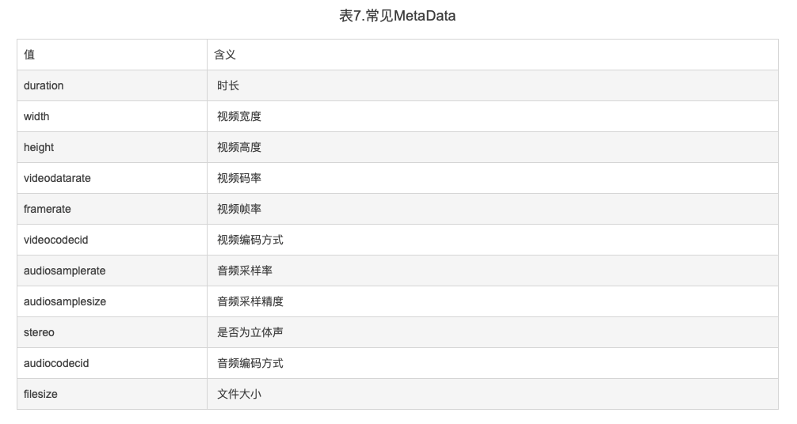 

**参考**
* https://www.adobe.com/content/dam/acom/en/devnet/flv/video_file_format_spec_v10.pdf
* https://juejin.im/post/6844903910801408013#heading-4
* https://blog.csdn.net/leixiaohua1020/article/details/17934487
* https://blog.csdn.net/jwybobo2007/article/details/9221657
* https://blog.csdn.net/sunshine_505/article/details/80924620

