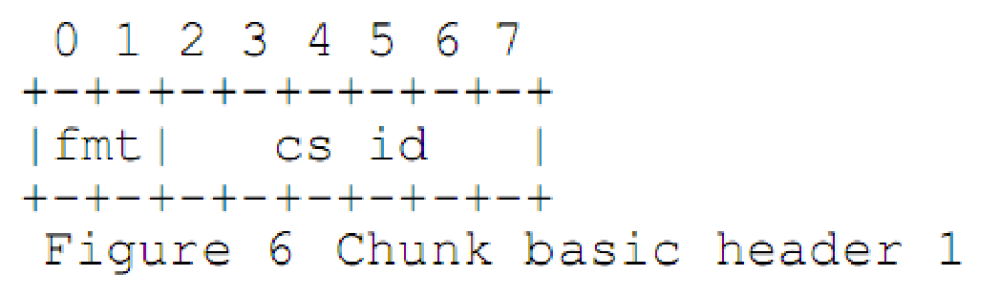
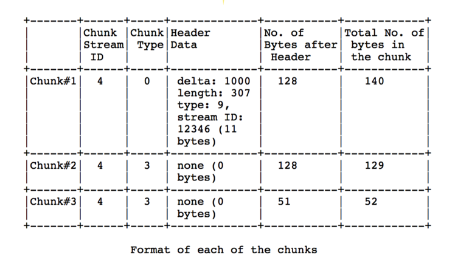
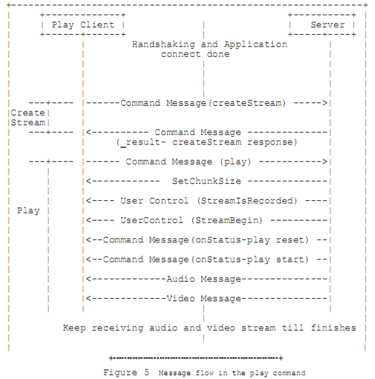

 2020年9月7日 北京 阴有雨，但中午可热了
 
 RTMP 笔记
 
rtmp 内容太多了。。。好记性不如烂笔头，留个念想吧
 
### ShakeHands

* client: 客户端需要发 3 个包。C0,C1,C2
* server: 服务端也需要发同样 3 个包。 S0,S1,S2

#### 握手步骤
* 客户端发送 C0,C1，此时客户端处于等待状态。客户端有两个限制：
    * 客户端在未接受到 S1 之前不能发送 C2 包
    * 客户端在未接收到 S2 之前不能发送任何实际数据包

* 服务端在接受到 C0，发送 S0，S1 包。也可以等到接受到 C1 之后再一起发送，C1 包的等待不是必须的。此时，服务端处于等待状态。服务端有两个限制：
    * 服务端在未接受到 C1 之前不能发送 S2.
    * 服务端在未接收到 C2 之前不能发送任何实际数据包

* 客户端接受到 S1/S0 包后，发送 C2 包。
* 服务端接受到 C2 包后，返回 S2 包，并且此时握手已经完成。

**备注：**
* 实际并不是严格按照上面的规则来，rtmp并不是强安全的协议，有一种通用模式：
    * C0+C1
    * S0+S1+S2
    * C2
        * Client发送带有1byte的C0和固定长度为1536byte的C1。 
        * Server发送S0S1S2给Client。
        * Client发送C2。
* 需要提及的是，RTMP 默认都是使用 Big-Endian 进行写入和读取，除非强调对某个字段使用 Little-Endian 字节序。

#### C0 和 S0 消息格式

* C0 和 S0 的长度为 1B，也就是一个字节，它的主要工作是确定 RTMP 的版本号。
* C0：客户端发送其所支持的 RTMP 版本号：3~31。一般都是写 3。
* S0：服务端返回其所支持的版本号。如果没有客户端的版本号，默认返回 3。

**备注**
* 0-2 是早期产品所用的，已被丢弃；4-31 保留在未来使用 ； 32-255 不允许使用 （为了区分其他以某一字符开始的文本协议）。如果服务无法识别客户端请求的版本，应该返回 3 。客户端可以选择减到版本 3 或选择取消握手

#### C1 和 S1 消息格式

* time： 4 字节，本字段包含时间戳。
* zero： 4 字节，本字段必须是全零。
* random： 1528 字节。主要内容就是随机值

**备注**
* time该时间戳应该是发送这个数据块的端点的后续块的时间起始点。可以是 0， 或其他的任何值。为了同步多个流，端点可能发送其块流的当前值。
* zero字段必须是全零
* random字段可以包含任何值。因为每个端点必须用自己初始化的握手和对端初始化的握
手来区分身份，所以这个数据应有充分的随机性。但是并不需要加密安全的随机值，或
者动态值。

#### C2 和 S2 消息格式
C2 和 S2 消息有 1536 字节长。 只是 S1 和 C1 的回复。

* time: 4个字节，时间戳，同上，也不是很重要
* time2: 4个字节，C1/S1 发送的时间戳。
* random: S1/C1 发送的随机数。长度为 1528B。

**备注**
* time字段必须包含对等段发送的时间（对 C2 来说是 S1，对 S2 来说是 C1）。
* time2字段必须包含先前发送的并被对端读取的包的时间戳
* random字段必须包含对端发送的随机数据字段（对 C2 来说是 S1，对 S2 来说是 C1）。
每个对等端可以用time和time2字段中的时间戳来快速地估计带宽和延迟。 但这样做可
能并不实用。

### Chunk 块
#### Chunking 分块
* 握手之后，连接开始复用一个或多个块流。 每个块流承载来自一个消息流的一类消
息。 每个被创建的块都关联到一个唯一的块流 ID。 所有的块都通过网络传输。在传输过
程中，必须一个块发送完之后再发送下一个块。 在接收端，每个块都根据块 ID 被收集成
消息
* 分块使高层协议的大消息分割成小的消息，保证大的低优先级消息不阻塞小的高优
先级消息
* 分块把原本应该消息中包含的信息压缩在块头中减少了小块消息发送的开销。块大小是可配置的。这个可以在 7.1 节中描述的块消息中完成。 最大块是 65535 字节，最小块是 128 字节。块越大 CPU 使用率越低，但是也导致大的写入，在低带宽下产生其他内容的延迟。块大小对每个方向都保持独立。

#### Chunk 结构
块由header和data组成，header又由三部分组成，结构如下：

* basic header: 1到3个字节
    * 本字段包含块流 ID(chunk stream id) 和块类型(fmt)。
    * fmt决定编码的消息头的格式。
    * 本字段长度取决于块流ID，块流 ID 是可变长字段。
* message header：0， 3， 7 或 11 字节
    * 本字段编码要发送的消息的信息。本字段的长度，取决于块头中指定的块类型
* 扩展时间戳： 0 个或 4 字节 
    * 本字段必须在发送普通时间戳（普通时间戳是指message header中的时间戳） 设置为0xffffff 时发送，正常时间戳为其他值时都不应发送本值。当普通时间戳的值小于 0xffffff时，本字段不用出现，而应当使用正常时间戳字段。

#### Basic Header (1~3 byte)
* RTMP 中的 Header 分为 Basic Header 和 Message Header。需要注意，他们两者并不是独立的，而是相互联系。Message Header 的结构由 Basic Header 的内容来决定。
* basic header包括块流ID（csid）和块类型(fmt)。块类型决定message header的
格式。basic header可能是 1， 2 或 3 个字节。这取决于块流 ID。
* rtmp最多支持65597个ID为3–65599的流。 ID 0、1和2作为保留值。 
    * 值0表示ID范围为64-319（第二个字节+ 64）。 
    * 值1表示ID范围为64-65599（（第三个字节）* 256 +第二个字节+ 64）。 
    * 值2指示其低级协议消息，没有额外的字节描述流id
    * 3–63范围内的值表示完整的流ID，没有用于表示它的其他字节。

##### 块流 ID 3-63 可用 1 字节来表示

##### 块流 ID 64-319 可以用 2 字节表示 

* 注意上面的 cs id - 64。这个代表的是第二个字节+64

##### 块流 ID64-65599 可以用 3 字节表示

* 上面的csid计算方式：为第三个字节*255+第二个字节+64

**总结：**
* csid: 占6位
    * 本字段表示范围在 3-63 的csID值，0和1表示basic header的2或3字节版本结构
* fmt: 占2位
    * 本字段表示message header的 4 种格式
* csid-64: 占 8-16 位
    * 本字段包含csid 减去 64 的值

**注意**
* 块流 ID 在 64-319 范围之内，可以用 2 个字节版本表示，也可以用 3 字节版本表示.

#### Message Header (0， 3， 7 或 11 byte)
Basic header 中的fmt块类型决定了message header的大小，fmt占两位，总共四种

##### fmt=0
此类型下message header大小为11字节，在一个块流的开始和时间戳返回的时候必须有这种块

* timestamp（时间戳）：占用3个字节
* message length（消息数据的长度）：占用3个字节，表示实际发送的消息的数据如音频帧、视频帧等数据的长度，单位是字节。注意这里是Message的长度，也就是chunk属于的Message的总数据长度，而不是chunk本身Data的数据的长度。
* message type id(消息的类型id)：占用1个字节，表示实际发送的数据的类型，如8代表音频数据、9代表视频数据。
* msg stream id（消息的流id）：占用4个字节，表示该chunk所在的流的ID，和Basic Header的CSID一样，**它采用小端存储的方式**

**备注**
* 对于该类型的块。timestamp：消息的绝对时间戳在这里发送。如果时间戳大于或等于16777215（16 进制 0x00ffffff），该值必须为 16777215，并且扩展时间戳必须出现。否则该值就是整个的时间戳。

##### fmt=1
此类型下message header占 7 个字节长。msg stream id 不包含在本块中, 表明当前块的msg stream id与先前的块相同。 具有可变大小消息的流，在第一个消息之后的每个消息的第一个块应该使用这个格式

* 省去了表示msg stream id的4个字节，表示此chunk和上一次发的chunk所在的流相同
* timestamp delta：占用3个字节，注意这里和type＝0时的timestamp不同，此处timestamp delta存储的是和上一个chunk的时间差

##### fmt=2
类型 2 的块占 3 个字节。既不包含流 ID 也不包含消息长度。本块使用的流
ID 和消息长度与先前的块相同。具有固定大小消息的流，在第一个消息之后的
每个消息的第一个块应该使用这个格式

* 相对于type＝1格式又省去了表示消息长度的3个字节和表示消息类型的1个字节，表示此chunk和上一次发送的chunk所在的流、消息的长度和消息的类型都相同
* 余下的这三个字节表示timestamp delta，意义同type＝1

##### fmt=3
类型3占用0字节，也就是没有message header，这种类型的块使用与先前块相同的数据。当一个消息被分成多个块，除了第一块以外，所有的块都应使用这种类型。
* 它表示这个chunk的Message Header和上一个是完全相同的。
* 当它跟在**fmt＝0**的chunk后面时，表示和前一个chunk的时间戳都是相同的。
    * 什么时候连时间戳都相同呢？就是一个Message拆分成了多个chunk，这个chunk和上一个chunk同属于一个Message。
* 当它跟在**fmt＝1**或者**fmt＝2**的chunk后面时，表示和前一个chunk的时间戳的差是相同的。
    * 比如第一个chunk的Type＝0，timestamp＝100，第二个chunk的Type＝2，timestamp delta＝20，表示时间戳为100+20=120，第三个chunk的Type＝3，表示timestamp delta＝20，时间戳为120+20=140

#### Extended Timestamp 扩展时间戳

* 只有当块message header中的普通时间戳设置为 0x00ffffff 时，本字段才被传送。 
* 如果普通时间戳的值小于 0x00ffffff，那么本字段一定不能出现。
* 如果时间戳字段不出现本字段也一定不能出现。
* fmt=3的块一定不能含有本字段。
* 如果发送本字段，则该字段位于块message header之后，块data之前。
* 表示应该去扩展时间戳字段来提取真正的时间戳或者时间戳差
* 扩展时间戳存储的是完整值，而不是减去时间戳或者时间戳差的值
* 扩展时间戳占4个字节，能表示的最大数值就是0xFFFFFFFF＝4294967295

#### Chunk Data 块数据
用户层面上真正想要发送的与协议无关的数据，长度在(0,chunkSize]之间

### 消息分块实例
#### 实例1
下面展示一个简单的音频消息流。这个例子显示了信息的冗余。

而下表显示了这个流产生的块。从消息 3 开始，数据传输开始优化。在消息 3
之后，每个消息只有一个字节的开销

* 首先包含第一个Message的chunk的Chunk Type为0，因为它没有前面可参考的chunk，timestamp为1000，表示时间戳。type为0的header占用11个字节，假定chunkstreamId为3<127，因此Basic Header占用1个字节，再加上Data的32个字节，因此第一个chunk共44＝11+1+32个字节。
* 第二个chunk和第一个chunk的CSID，TypeId，Data的长度都相同，因此采用Chunk Type＝2，timestamp delta＝1020-1000＝20，因此第二个chunk占用36=3+1+32个字节。
* 第三个chunk和第二个chunk的CSID，TypeId，Data的长度和时间戳差都相同，因此采用Chunk Type＝3省去全部Message Header的信息，占用33=1+32个字节。
* 第四个chunk和第三个chunk情况相同，也占用33=1+32个字节。

#### 实例2
下面演示一个消息由于太长，而被分割成 128 字节的块

未分块时：

拆成块：

* 注意到Data的Length＝307>128,因此这个Message要切分成几个chunk发送，第一个chunk的Type＝0，Timestamp＝1000，承担128个字节的Data，因此共占用140=11+1+128个字节。
* 第二个chunk也要发送128个字节，其他字段也同第一个chunk，因此采用Chunk Type＝3，此时时间戳也为1000，共占用129=1+128个字节。
* 第三个chunk要发送的Data的长度为307-128-128=51个字节，还是采用Type＝3，共占用1+51＝52个字节。

### Message
* chunk data 就是我们说的RTMP Message
* 服务端和客户端通过在网络上发送 RTMP 消息进行通讯。消息可能包含音频，视频，数据，或其他的消息
* RTMP 消息分头（header）和负载（payload）两部分

 
 * Message Type： 1 byte 
	 * 一个字节字段用于表示消息类型。范围在 1-7 内的消息 ID 用于协议控制消息
* Payload length（3 bytes) 
	* 三个字节字段用于表示负载的字节数。设置为 big-endian 格式
* Timestamp (4 bytes)  
	* 四字节字段包含消息的时间戳。 4 个字节用 big-endian 方式打包。
* Stream ID (3 bytes) 
	* 三字节字段标识消息流。这些字节设置为 big-endian 格式 
* Message Payload 真实数据
	* 负载时消息中包含的真实数据。 例如，它可以是音频样本或压缩的视频数据。

#### Message type - 协议控制消息
* RTMP 保留消息类型 ID 在 1-7 之内的消息为协议控制消息。这些消息包含 RTMP块流协议和 RTMP 协议本身要使用的信息。 ID 为 1 和 2 用于 RTMP 块流协议。 ID 在 3-6之内用于 RTMP 本身。 ID 7 的消息用于边缘服务与源服务器
* 协议控制消息必须消息流ID=0和块流ID=2，即Chunk Stream  ID = 0x02 && Message Stream ID = 0
* 并且有最高的发送优先级。 
* 每个协议控制消息都有固定大小的负载，并且作为一个独立的块发送。

##### message type =1 
* Set Chunk Size 设置块的大小，通知对端用使用新的块大小,共4 bytes。

* 块大小的值被承载为 4 字节大小的负载。块大小有默认的值，但是如果发送者希望改变这个值，则用本消息通知对等端。例如，一个客户端想要发送 131 字节的数据，而块大小是默认的 128 字节。那么，客户端发送的消息要分成两个块发送。客户端可以选择改变块大小为 131 字节，这样消息就不用被分割为两个块。客户端必须向服务端发送本消息来通知对方块大小改为 131 字节。
* 最大块大小为 65536 字节。服务端向客户端通讯的块大小与客户端向服务端通讯的块大小互相独立

##### message type = 2
* Abort Message 取消消息，用于通知正在等待接收块以完成消息的对等端,丢弃一个块流中已经接收的部分并且取消对该消息的处理，共4 bytes。

* 协议控制消息 2 是取消消息，用于通知正在等待接收块以完成消息的对等端，丢弃一个块流中已经接收的部分并且取消对该消息的处理。
* 对等端把这个消息的负载当作要丢弃的消息的块流 ID。当发送者已经发送了一个消息的一部分，但是希望告诉接收者消息的余下部分不再发送时，发送本消息。

##### message type = 3
 * Acknowledgement 确认消息，共4 bytes。

 * 客户端或服务端在接收到数量与窗口大小相等的字节后发送确认消息到对方。窗口大小是在没有接收到接收者发送的确认消息之前发送的字节数的最大值。服务端在建立连接之后发送窗口大小。本消息指定序列号。序列号,是到当前时间为止已经接收到的字节数。 

##### message type = 4
* User Control Message 用户控制消息，客户端或服务端发送本消息通知对方用户的控制事件。本消息承载事件类型和事件数据。消息数据的头两个字节用于标识事件类型。事件类型之后是事件数据。事件数据字段是可变长的。

##### message type = 5
* Window Acknowledgement Size 确认窗口大小,客户端或服务端发送本消息来通知对方发送确认(致谢)消息的窗口大小,共4 bytes.

##### message type = 6
* Set Peer Bandwidth 设置对等端带宽
* 客户端或服务端发送本消息更新对等端的输出带宽。输出带宽值与窗口大小值相同。如果对等端在本消息中收到的值与窗口大小不相同，则发回确认（致谢）窗口大小消息。

* 发送者可以在限制类型字段把消息标记为硬（0），软（1），或者动态（2）。如果是硬限制对等端必须按提供的带宽发送数据。如果是软限制，对等端可以灵活决定带宽，发送端可以限制带宽。如果是动态限制，带宽既可以是硬限制也可以是软限制。

#### Message type - 其他类型消息
* 服务端和客户端之间交换的消息包括发送音频数据的音频消息，发送视频数据的视频消息，发送用户数据的数据消息，共享对象消息和命令消息。 共享对象消息，在多个客户端和服务端之间管理分布数据。
* 命令消息在客户端和服务端之间承载 AMF 编码命令。客户端和服务端可以通过使用命令消息向对方请求远程过程调用
* [AMF0编码格式](https://wwwimages2.adobe.com/content/dam/acom/en/devnet/pdf/amf0-file-format-specification.pdf)
* [AMF3编码格式地址失效]()
* 服务端和客户端通过在互连网发送消息来通讯。 消息包括音频消息，视频消息，命令消息，共享对象消息，数据消息，用户控制消息。

##### Command Message(命令消息，Message Type ID＝17或20)
* 用AMF编码的客户端与服务端之间的命令。消息类型为20的用AMF0编码，消息类型为 17 的用 AMF3 编码
* 这些消息用于在远端实现连接，创建流，发布，播放和暂停等操作。 状态，结果等命令消息用于通知发送者请求命令的状态。命令消息由命令名，传输 ID，和包含相关参数的命令对象组成。客户端或服务端可以使用命令消息向远端请求远程过程调用。

##### Data Message（数据消息，Message Type ID＝15或18)
* 客户端或服务端通过本消息向对方发送元数据和用户数据。元数据包括数据的创建时间、时长、 主题等细节。 消息类型为 18 的用 AMF0 编码，消息类型为 15 的用 AMF3编码。

##### Shared Object Message(共享消息，Message Type ID＝16或19)
* 共享对象是跨多个客户端，实例同步的 FLASH 对象（名值对的集合）。消息类型kMsgContainer=19 用 AMF0 编码， kMsgContainerEx=16 用 AMF3 编码，这两个消息用于共享对象事件。每个消息可包含多个事件。

##### Audio Message（音频信息，Message Type ID＝8)
* 客户端或服务端发送本消息用于发送音频数据。消息类型 8 ，保留为音频消息

##### Video Message（视频信息，Message Type ID＝9）
* 客户端或服务端使用本消息向对方发送视频数据。消息类型值 9，保留为视频消息。
视频消息比较大，会造成其他消息的延迟。为了避免这种情况，这种消息被关联为最低
优先级。

##### Aggregate Message (聚集/聚合信息，Message Type ID＝22)
* 聚合消息是含有一个消息列表的一种消息。消息类型值 22，保留用于聚合消息

* 后端包含前面消息的包含头在内的大小。这个设置匹配 flv 文件格式，用于后向搜索。

**使用聚合消息的好处：**
* 块流在每个块中最多发送一个块。因此增加块的大小并且使用聚合消息可以减少块
数
* 子消息可以在内存上连续存储，这样可以在调用系统通过网络发送数据时更有效

##### User Control Message Events(用户控制消息)
* 客户端或服务端发送本消息通知对方用户控制事件。可以参考前面讲过的用户控制消息
* 是协议控制消息的一类，消息类型 ID为4：
    * Message Stream ID=0,Chunk Stream Id= 0x02,Message Type Id=0x04

### 命令类型
* 客户端和服务端 交换 AMF 编码的命令。发送端发送命令消息。命令消息由命令名，传输 ID，和命令对象组成。命令对象由一系列的相关参数组成。例如，连接命令包含”app”参数，这个参数告知服务端，客户端要连接的应用名。接收端处理命令并且返回含有相同传输 ID 的响应。响应字符串含有_result 或_error 或一个方法名， 例如，一个 verifyclient，或一个 contactExternalServer。
* 一个含有_result 或_error 的命令字符串表示一个响应。传输 ID，指示出响应所参考的显著的命令？ 。这个相当于 IMAP 或其他协议中的标签。命令字符串中的方法名表示发送端想要在接收端运行一个方法
* Command Msg 主要分为 net connect 和 net stream 两大块。它的交流方式是双向的，即，你发送一次 net connect 或者 stream 之后，另外一端都必须返回一个 _result 或者 _error 以表示收到信息
* NetConnection-代表服务端和客户端之间连接的更高层的对象
* NetStream-代表发送音频流，视频流和其他相关数据的通道的对象。我们也发送像
播放，暂停等控制数据流动的命令。

#### NetConnection 命令
* NetConnection 管理服务端和客户端之间的双路连接。另外，它还支持异步远程方
法调用。下列的方法可以通过 NetConnection 发送：
    * connect 连接
    * call 调用
    * close 关闭
    * createStream 创建流
    
##### Connect 
* 客户端向服务端发送一个连接命令请求连接到一个服务应用实例。客户端到服务端的命令结构如下：

* Following is the description of the name-value pairs used in Command
Object of the connect command.下面是在连接命令的命令对象中使用的名值对的描述:

* 音频编解码器属性值

* 视频编解码器属性值

* connect命令消息交互流程：

* 执行步骤：
    * 客户端发送连接命令到服务端，请求与一个服务应用实例建立连接。
    * 接收到连接命令后，服务端发送”窗口确认消息”到客户端。服务端同时连接到连接命令中提到的应用。
    * 服务端发送”设置带宽”协议消息到客户端。
    * 在处理完”设置带宽”消息后， 客户端发送”窗口确认大小”消息到服务端。
    * 服务端发送用户控制消息中的流开始消息到客户端。
    * 服务端发送结果命令消息通知客户端连接状态。该命令指定传输 ID（对于连接命令总是 1）。同时还指定一些属性，例如， Flash media server 版本（字符串），能力（数字）， 以及其他的连接信息，例如，层（字符串），代码（字符串），描述（字符串），对象编码（数字）等

##### Call 调用
* NetConnection 对象的调用方法在接收端运行远程过程调用。远程方法的名作为调
用命令的参数。
* 从发送端到接收端的命令结构如下：

* 命令相应结构如下：

##### CreateStream 创建流
* 客户端发送本命令到服务端创建一个消息通讯的逻辑通道。 音频，视频和元数据的
发布是由创建流命令建立的流通道承载的
* NetConnection 本身是默认的流通道，具有流 ID 0 。 协议和一少部分命令消息，包
括创建流，就使用默认的通讯通道。

* 从客户端到服务端的命令结构如下：

* 从服务端到客户端的命令结构如下：

#### NetStream 命令
* NetStream 定义，基于连接客户端和服务端的 NetConnection 对象的，可以使音频流，视频流和数据消息传输的通道。 对于多数据流，一个 NetConnection 对象可以支持多个 NetStreams。
* 下列的命令可以在 netstream 上发送。
    * play
    * play2
    * deleteStream
    * closeStream
    * receiveAudio
    * receiveVideo
    * receiveVideo
    * seek
    * pause

##### play
* 客户端发送本命令到服务端播放一个流。 使用本命令多次也可以创建一个播放列表。如果想创建一个可以在不同的直播流或录制流间切换的动态播放列表，可以多次使用播放命令，并且将重设设为假。 相反，如果想立即播放一个流。清楚队列中正在等待的其它流，将重设设为真。
* 从客户端到服务端的命令结构入下：

汉化版：

* 从服务端到客户端的命令结构如下：

汉化版：

* 交互流程：

* 步骤：
    * 客户端从服务端接收到流创建成功消息，发送播放命令到服务端。
    * 接收到播放命令后，服务端发送协议消息设置块大小。
    * 服务端发送另一个协议消息（用户控制消息），并且在消息中指定事件”streamisrecorded”和流 ID。消息承载的头 2 个字， 为事件类型，后 4 个字节为流 ID。
    * 服务端发送事件”streambegin”的协议消息（用户控制），告知客户端流 ID。
    * 服务端发送响应状态命令消息 NetStream.Play.Start&NetStream.Play.reset，如果客户端发送的播放命令成功的话。 只有当客户端发送的播放命令设置了 reset 命令的条件下，服务端才发送 NetStream.Play.reset 消息。如果要发送的流没有找的话，服务端发送 NetStream.Play.StreamNotFound 消息。
* 在此之后服务端发送客户端要播放的音频和视频数据。

##### play2 
* 和play命令不同，play2 命令可以切换到不同的码率，而不用改变已经播放的内
容的时间线。服务端对play2命令可以请求的多个码率维护多个文件。
* 从客户端到服务端的命令结构入下：

汉化版：

* 交互流程：

##### deleteStream 
* 当 NetStream 对象销毁的时候发送删除流命令
* 从客户端到服务端的命令结构入下：

汉化版：

* 服务端不返回任何响应

##### receiveAudio 
* NetStream 对象发送接收音频消息通知服务端发送还是不发送音频到客户端。
* 从客户端到服务端的命令结构入下：

汉化版：

* 服务端不返回任何响应

##### receiveVideo
* NetStream 对象发送 receiveVideo 消息通知服务端是否发送视频到客户端。
* 从客户端到服务端的命令结构入下：

汉化版：

* 服务端不返回任何响应

##### Publish
* 客户端发送一个发布命令，发布一个命名流到服务端。 使用这个名字，任何客户端可
以播放该流并且接收音频，视频，和数据消息
* 从客户端到服务端的命令结构入下：

汉化版：

* 服务端用响应状态命令响应表示一个发布的开始

##### seek
* 客户端发送seek命令在一个媒体文件中或播放列表中seek偏移
* 从客户端到服务端的命令结构入下：

汉化版：

* 如果seek成功服务端发送一个 NetStream.Seek.Notify 状态消息。如果失败，则返回含有_error 的消息。

##### pause
* 客户端发送暂停命令告诉服务端暂停或开始一个命令。
* 从客户端到服务端的命令结构入下：

汉化版：

* 当流暂停的时候，服务端发送一个 NetStream.Pause.Notify 状态消息。当恢复播放的时候发送 NetStream.Unpause.Notify 消息。如果失败，则返回_error 消息

### 参考
* https://zhuanlan.zhihu.com/p/51509123
* https://www.zybuluo.com/sheepbao/note/498380
* https://blog.csdn.net/lightfish_zhang/article/details/88681828
* 智媒黑板报公众号

